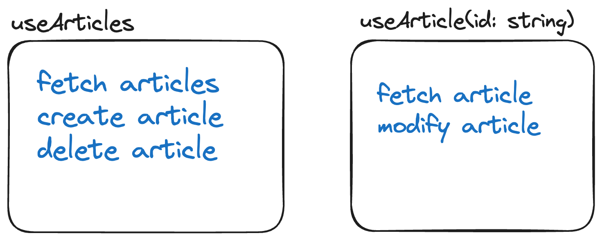
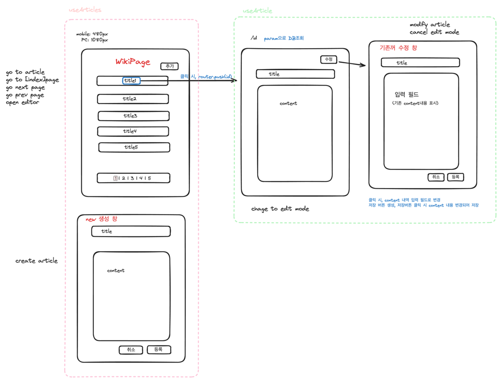

# WikiPage

'WikiPage'는 코딩허브에서 제공하는 강의와 관련된 정보를 공유하고 검색할 수 있는 게시판입니다.

## 프로젝트 실행 방법
이 프로젝트에서는 패키지 매니저로 [bun](https://bun.sh/docs)을 사용했습니다.

```typescript
bun install

//window
copy .env.example .env
//macOS or Linux
cp .env.example .env

bun run db:push

bun postinstall

bun dev

```

## 사용한 기술 스택

     

## 주요 기능

1. 위키페이지 목록: 첫 페이지에서 위키페이지의 제목들을 목록 형태로 보여줍니다. 한 페이지에 최대 5개의 제목을 표시하며, 5개를 초과하는 경우 페이지네이션을 통해 나누어 표시합니다.
2. 위키페이지 상세보기: 각 위키페이지 제목을 클릭하면 해당 페이지의 제목과 본문을 볼 수 있습니다. 본문 내에 다른 위키페이지로의 링크가 포함될 수 있습니다.
3. 새 위키페이지 작성: 메인페이지에서 '추가' 버튼을 클릭하여 새로운 위키페이지를 작성할 수 있는 창이 나타납니다. 사용자는 제목과 내용을 입력할 수 있습니다.
4. 위키페이지 수정: 각 위키페이지에는 수정 버튼이 있으며, 이를 통해 기존의 내용을 수정하고 저장할 수 있습니다.
#### 추가 기능
- 위키페이지 목록 삭제: 메인 페이지의 위키페이지의 제목들 목록에서 X 버튼을 눌러 글을 삭제할 수 있습니다.


## 데모 영상

Vercel을 통해 배포 [DEMO](https://wiki-rev.vercel.app/)
<br/>
<br/>
1. WikiPage 메인페이지(게시글 제목 리스트) 
- article 제목 리스트 조회<br/>
<br/>
- 한 페이지당 5개의 article로 pagination<br/>
</br>
- article 추가<br/>
<br/>
- article 삭제<br/>
<br/>
- 클릭한 article 상세 페이지로 이동<br/>
<br/>
<br/>

2. WikiPage 상세보기 페이지 (특정 게시글)
- article 상세 조회<br/>
<br/>
- article 수정<br/>
<br/>
- 백링크 통해 이동<br/>
<br/>


## 데이터 스키마
- id: string
- title(제목): string
- content(내용): string
- createdDate(생성 날짜): Date
- updatedDate(수정 날짜): Date

## 설계 과정

### 요구사항 분석
1. 상태 정의 :프로젝트에서 필요한 주요 상태는 `'글 제목의 목록'`과 `'특정 글의 디테일'`입니다.
2. 인터페이스 정의: `create article`, `read article, read articles list`, `update article`, `delete article`


### hook으로 service layer 구현
두가지 상태는 서로 다른 관심사를 가지고 있기 때문에 각 기능의 독립성을 보장하고, 관련없는 렌더링을 최소화하기 위해 각 상태와 관련된 로직을 분리하여 구현하였습니다.<br/>
<br/>
<br/>


<br/>

### 인터페이스 구현
TypeScript, tRPC, Prisma, 그리고 React Query를 사용하여 효율적인 데이터 관리 및 통신 인터페이스를 구축했습니다.
- 사용자 경험 최적화와 데이터 일관성 유지 <br/>
  사용자가 서버의 데이터와 동일한 데이터를 실시간으로 확인할 수 있도록, 데이터 일관성과 사용자 경험 최적화에 중점을 두었습니다. 특히, 데이터 수정(create, update, delete) 작업 후 클라이언트 측 데이터의 신속한 동기화가 중요했습니다.<br/>

- `mutation(create,update,delete)` 동작으로 인해 변경된 서버의 데이터가 클라이언트 데이터에도 바로 반영되도록 `React Query의 invalidateQuery option`을 사용했습니다.
```typescript
// (/src/hooks/useArticles.ts)

const createArticle = async (payload: CreateArticlePayload) => {
  const response = await createMutation.mutateAsync(payload, {
    onSettled: () => {
      queryClient
        .invalidateQueries(ARTICLES_LIST_QUERY_KEY)
        .catch(console.error);
    },
  });
  return response;
};
```


### `article detail` 페이지에서 백링크 구현
기능 설명: `article` 본문 내용 중 다른 `article` 제목과 일치하는 텍스트가 있을 경우, 이를 백링크로 변환하여 해당 페이지로 쉽게 이동할 수 있게 합니다.
1. `article list`의 정규화<br/>
본문 내의 특정 키워드를 링크로 변환할 때, `article list` 데이터에 접근해서 `article`의 id를 찾게 됩니다. <br/>
어떠한 데이터에 접근해야할 때 배열보다 객체 형태가 더 효율적입니다.
따라서 데이터 접근을 최적화하기 위해 객체 배열로 되어 있는 `article list`를 객체 형태로 변환하는 '정규화' 과정을 거쳤습니다.

    ```typescript
   // (/src/utils/normalizeArticle.ts)
   
    export const normalizeArticleListByTitle = (articles: ArticlesTitleList) => {
      return articles.reduce<Record<string, ArticlesTitleItem>>((acc, cur) => {
        acc[cur.title] = cur;
        return acc;
     }, {});
    };
    ```
<br/>

  
2. 백링크를 위한 키워드 등록<br/>
`normalizedArticles` 객체에서 모든 키(즉, 아티클 제목)를 추출합니다. 그리고 이 키워드들을 `linkify` 라이브러리에 등록합니다.<br/>
`linkifyRegisterKeywords` 함수는 특정 키워드들을 `linkify` 라이브러리에 등록하여, 본문 내에서 해당 키워드들이 나타날 때 자동으로 링크로 변환되게 합니다.
    ```typescript
   // (/src/components/article/ArticleDeatilSection.tsx)
   
   const titleKeywords = useMemo(
       () => Object.keys(normalizedArticles),
       [normalizedArticles],
    );
    
   linkifyRegisterKeywords(titleKeywords);
    ```
<br/>

3. 링크 생성 및 렌더링<br/>
   마지막으로, `LinkifyOptions`를 설정하여 각 키워드에 대한 링크의 형태와 렌더링 방식을 정의합니다.<br/> `formatHref` 옵션은 링크의 `URL`을 결정하는 로직을 포함합니다. 이 경우, 각 키워드에 해당하는 아티클의 `ID`를 `URL`로 사용하여, 사용자가 해당 키워드를 클릭하면 관련된 아티클로 이동하도록 합니다.
    ```typescript
    // (/src/components/article/ArticleDeatilSection.tsx)
   
    const options: LinkifyOptions = {
      formatHref: {
        keyword: (keyword) => {
          const item = normalizedArticles[keyword];
          if (!item) {
            return '#';
          }
           return `/article/${item.id}`;
        },
      },
      render: ({ attributes, content }) => {
        const href = String(attributes?.href ?? '#');
        return (
          <Link href={href} className="text-blue-400">
            {content}
          </Link>
        );
      },
    };
    ```
<br/>

### `articleList` 페이지에서 Pagination 구현
- 한 페이지 5 article로 pagination 구현
- article list를 클라이언트에서 관리하고 있기 때문에 클라이언트에서 pagination 담당하는 것으로 구현
- prev, next 버튼으로 페이지 순회
